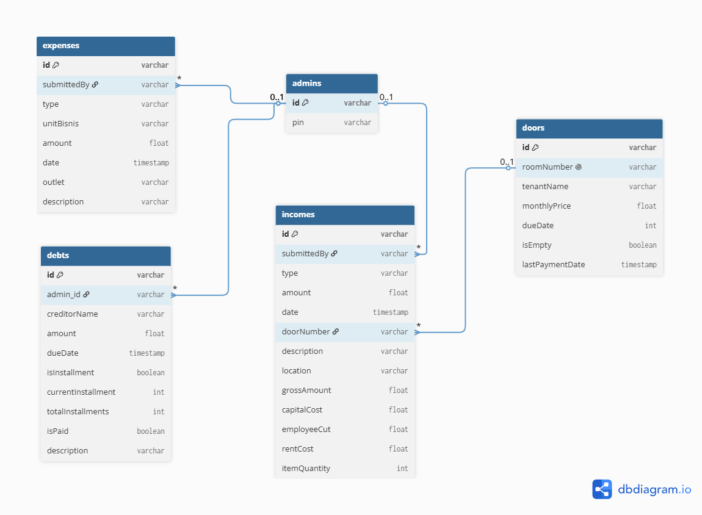
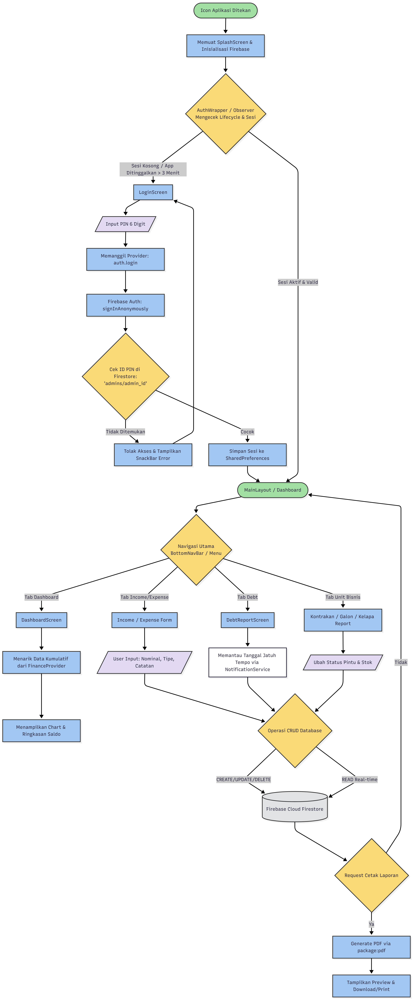
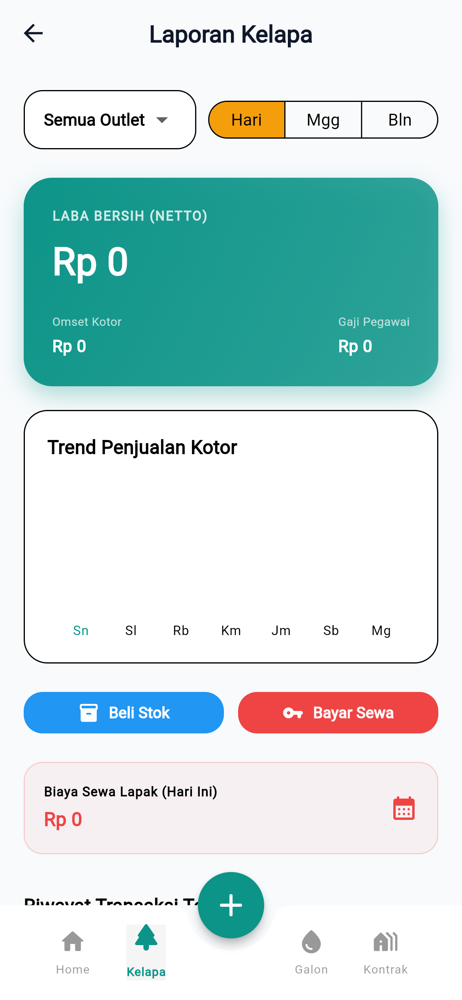
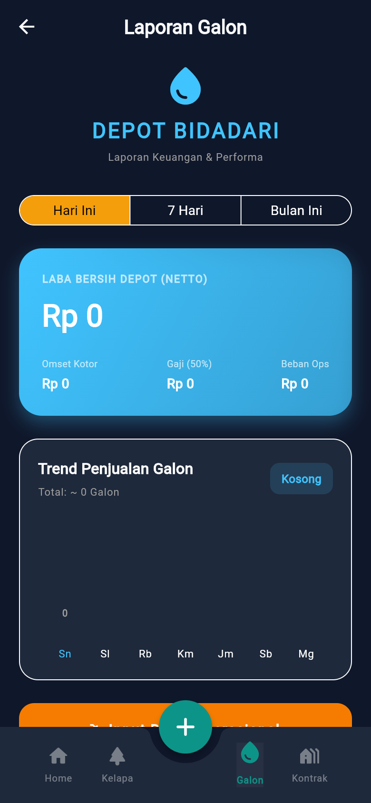
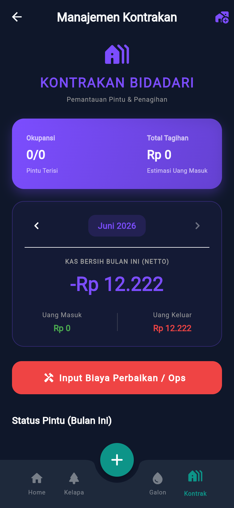
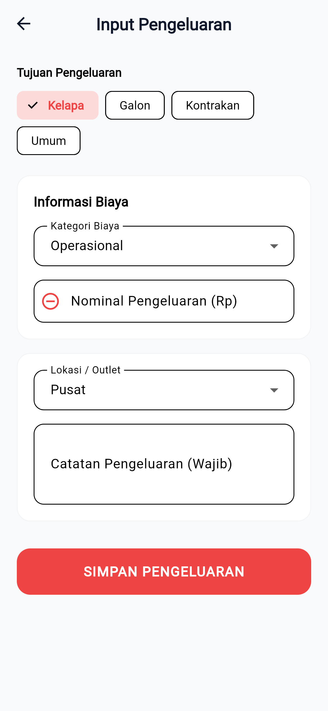
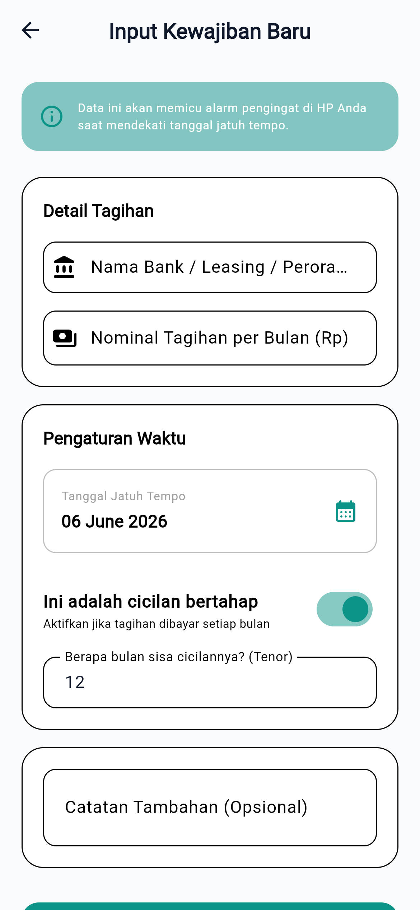
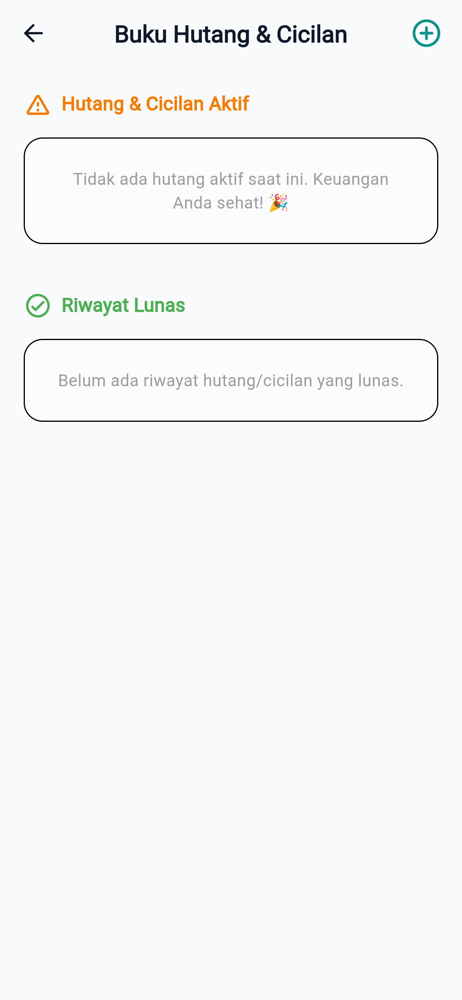

# TUGAS MINGGU 1: Perencanaan dan Desain (Fase Konseptual)

**Nama Proyek:** Aplikasi Manajemen Keuangan  
**Anggota Kelompok:**
- Bagas Sujiwo (2306018)
- Romy Zaenul Alam (2306019) 
- Firman Nur Hakim (2305107) 

**Mata Kuliah:** Pemrograman Mobile  

---

## 1. Ruang Lingkup (Scope) 

Berdasarkan *source code* dan struktur direktori yang telah diaudit, aplikasi Bidadari ERP adalah sebuah perangkat lunak manajemen keuangan dan aset berskala *Enterprise* yang dirancang secara khusus untuk memantau beragam aliran bisnis. Berikut adalah penjabaran seluruh fitur komprehensif di dalamnya:

1. **Sistem Keamanan Autentikasi Internal (PIN & Auto-Lock)**
   - Fitur *login* tidak menggunakan registrasi terbuka, melainkan sistem tertutup menggunakan validasi PIN 6 digit.
   - Dilengkapi *AuthWrapper* yang secara otomatis mengunci aplikasi (memaksa *logout* atau minta PIN ulang) jika aplikasi ditinggalkan di latar belakang (*background*) lebih dari batas waktu yang ditentukan.
2. **Dashboard Keuangan Terpusat (Dashboard Screen)**
   - Menyajikan *summary* (ringkasan) total arus kas secara *real-time*.
   - Menampilkan statistik kumulatif dari berbagai unit bisnis.
3. **Manajemen Arus Kas Reguler (Income & Expense)**
   - **Pemasukan:** Fitur pencatatan dana masuk (CRUD) melalui antarmuka `income_form_screen.dart`.
   - **Pengeluaran:** Fitur pencatatan beban operasional atau pengeluaran lainnya melalui `expense_form_screen.dart`.
4. **Manajemen Hutang dan Cicilan (Debt Management)**
   - Modul khusus (`debt_form_screen.dart` & `debt_report_screen.dart`) untuk melacak hutang kepada entitas (bank, leasing, individu).
   - Memantau total pinjaman, besaran angsuran, dan melacak status jatuh tempo pelunasan.
5. **Manajemen Multi-Unit Bisnis Sampingan**
   - **Manajemen Kontrakan (`kontrakan_report_screen.dart`):** Melacak status pintu kontrakan (terisi/kosong), rekam jejak identitas penyewa, hingga pemantauan jadwal pembayaran per pintu (menggunakan `door_model.dart`).
   - **Bisnis Air Galon (`galon_report_screen.dart`):** Modul spesifik untuk mencatat dan memantau stok serta pendapatan dari penjualan air galon.
   - **Bisnis Kelapa (`kelapa_report_screen.dart`):** Modul spesifik untuk pencatatan rekapitulasi distribusi atau penjualan produk kelapa.
6. **Sistem Notifikasi Lokal (Local Notifications)**
   - Menggunakan `notification_screen.dart` dan `notification_service.dart` untuk memberikan peringatan dini kepada pemilik terkait jadwal jatuh tempo angsuran hutang atau tagihan penyewa kontrakan.
7. **Modul Ekspor Laporan Fisik (Cetak PDF)**
   - Fitur untuk menghasilkan dokumen laporan transaksi dan *summary* bisnis dalam format berkas PDF (*Portable Document Format*) yang dapat langsung dicetak atau dibagikan.
8. **Kustomisasi Tema (Enterprise UI - Light/Dark Mode)**
   - Sistem perpindahan tema (*light/dark*) yang diatur secara sentral di `theme_provider.dart` agar nyaman digunakan dalam kondisi pencahayaan apa pun.

---

## 2. Pemilihan Tech Stack 

Arsitektur perangkat lunak dibangun menggunakan kombinasi teknologi modern agar aplikasi bersifat lintas platform (Android, iOS, Web) dan dapat diandalkan kinerjanya. Berdasarkan audit pada file `pubspec.yaml`, *tech stack* yang digunakan adalah:

### **A. Framework & Bahasa Pemrograman**
- **Flutter SDK (>=3.3.0):** *Framework* utama berbasis UI untuk membangun aplikasi multi-platform.
- **Dart:** Bahasa pemrograman di balik Flutter yang mengeksekusi logika secara asinkronus dan kuat dalam paradigma OOP.

### **B. Sistem Backend & Database (BaaS)**
- **Firebase Core (`firebase_core: ^2.24.2`):** Jembatan penghubung utama antara Flutter dan ekosistem Google Cloud.
- **Firebase Authentication (`firebase_auth: ^4.17.8`):** Menangani sesi *Anonymous Login* di belakang layar tanpa mengharuskan input *email* dari pengguna.
- **Cloud Firestore (`cloud_firestore: ^4.15.8`):** Basis data relasional dokumen (NoSQL) yang menyimpan seluruh objek keuangan (Pemasukan, Pengeluaran, Hutang, Kontrakan) secara *real-time*.

### **C. State Management**
- **Provider (`provider: ^6.1.1`):** Digunakan untuk menyuntikkan dan memantau pembaruan UI (melalui `ChangeNotifier`) agar aplikasi merespons perubahan data seketika tanpa harus melakukan *rebuild* keseluruhan halaman. Proyek ini menggunakan 3 lapisan *provider*: `AuthProvider`, `FinanceProvider`, dan `ThemeProvider`.

### **D. Package & Library Krusial Lainnya**
- **Sistem Cetak & Ekspor PDF:** Menggunakan *library* `pdf (^3.11.0)` sebagai mesin (*engine*) perakit dokumen dan `printing (^5.12.0)` untuk menjembatani sistem cetak sistem operasi (*print spooler*).
- **Manajemen Notifikasi & Waktu:** Menggunakan `flutter_local_notifications (^17.0.0)` untuk memunculkan peringatan sistem (UI lokal) dan `timezone (^0.9.2)` untuk menghitung penjadwalan secara presisi berdasarkan zona waktu lokal.
- **UI & Formatting:**
  - `google_fonts (^6.1.0)`: Memasok fon *Enterprise* profesional (seperti PlusJakartaSans/Poppins).
  - `shimmer (^3.0.0)`: Memberikan efek *loading* animasi tulang punggung (skeleton) yang elegan saat data sedang ditarik dari awan.
  - `intl (^0.18.1)`: Mengatur *parsing* mata uang menjadi format Rupiah standar secara konsisten.
- **Penyimpanan Lokal (Cache):** Menggunakan `shared_preferences (^2.2.2)` untuk menyimpan *state* sementara di memori perangkat, serta `path_provider (^2.1.2)` untuk mencari direktori aman tempat hasil unduhan file PDF bersemayam.

---

## 3. Desain Struktur Data & Alur Logika (Flowchart)

### A. Skema Database (Cloud Firestore NoSQL)
Aplikasi ini menggunakan Cloud Firestore (NoSQL) tanpa *endpoint API REST* konvensional. Data disimpan dalam bentuk Koleksi (Collections) dan Dokumen (Documents). Berikut adalah rancangan skema 100% akurat berdasarkan entitas model (Dart) yang ada di dalam *source code*:

**1. Koleksi `admins` (Autentikasi Keamanan)**
Menyimpan akses masuk (PIN) untuk setiap pengguna/karyawan.
- `pin` (String): Kode akses 6 digit rahasia (contoh: "111111").

**2. Koleksi `incomes` (Model Pemasukan / `IncomeModel`)**
Pencatatan pendapatan bersih dan detail operasional dari setiap unit bisnis.
- `type` (String): Tipe pendapatan (`kelapa`, `galon`, `kontrakan`).
- `amount` (Double): Nominal pendapatan bersih (*Net Income*).
- `date` (String/ISO8601): Tanggal transaksi.
- `submittedBy` (String): Penginput data (Role: Admin/Karyawan).
- `description` (String): Catatan tambahan opsional.
- *Field Opsional (Khusus Kelapa):* `location`, `grossAmount`, `capitalCost` (HPP), `employeeCut`, `rentCost`, `itemQuantity`.
- *Field Opsional (Khusus Kontrakan):* `doorNumber` (Nomor pintu).

**3. Koleksi `expenses` (Model Pengeluaran / `ExpenseModel`)**
Pencatatan seluruh biaya dan modal keluar.
- `type` (String): Kategori pengeluaran (`modal`, `sewa`, `operasional`, `gaji`, `lainnya`).
- `unitBisnis` (String): Unit asal pengeluaran (`Kelapa`, `Galon`, `Kontrakan`, `Umum`).
- `amount` (Double): Nominal uang keluar.
- `date` (String/ISO8601): Tanggal transaksi.
- `outlet` (String): Lokasi pengeluaran (misal: "Pusat").
- `description` (String): Deskripsi wajib (Keamanan sistem agar audit jelas).

**4. Koleksi `doors` (Model Pintu Kontrakan / `DoorModel`)**
Manajemen spesifik untuk inventaris aset kamar/pintu kontrakan.
- `roomNumber` (String): Nomor kamar/pintu.
- `tenantName` (String): Nama penyewa.
- `monthlyPrice` (Double): Harga sewa bulanan.
- `dueDate` (Integer): Tanggal jatuh tempo per bulan (1 - 31).
- `isEmpty` (Boolean): Status kamar (`true` = kosong, `false` = terisi).
- `lastPaymentDate` (String/ISO8601 - Opsional): Kapan terakhir kali dibayar.

**5. Koleksi `debts` (Model Hutang / `DebtModel`)**
Manajemen tagihan dan cicilan eksternal.
- `creditorName` (String): Nama bank/leasing/perorangan.
- `amount` (Double): Nominal angsuran per bulan (atau total jika sekali bayar).
- `dueDate` (String/ISO8601): Tanggal jatuh tempo terdekat.
- `isInstallment` (Boolean): `true` jika cicilan bulanan, `false` jika sekali bayar lunas.
- `currentInstallment` (Integer): Angsuran ke-berapa saat ini.
- `totalInstallments` (Integer): Total tenor bulan.
- `isPaid` (Boolean): Status LUNAS TOTAL.
- `description` (String): Catatan tambahan.

 

**Visualisasi Skema Database (ERD / Collection Diagram):**

Diagram di bawah ini memetakan 5 entitas utama (Koleksi) yang ada di dalam database Firestore. Meskipun bersistem NoSQL (tanpa relasi kaku/Foreign Key), kelima entitas ini secara logis saling menopang satu sama lain untuk membentuk ekosistem ERP yang utuh (mulai dari Pemasukan, Pengeluaran, Hutang, hingga Aset Kamar).

---

### B. Alur Logika (Flowchart)

Visualisasi di bawah ini menggambarkan alur dari ujung ke ujung (*End-to-End*) yang sangat akurat dengan arsitektur aplikasi. Flowchart ini memetakan perjalanan pengguna mulai dari proses verifikasi keamanan (PIN) di pintu masuk, penjagaan sesi oleh *AuthWrapper*, hingga pencabangan ke berbagai modul bisnis (Dashboard, Arus Kas, Kontrakan), yang seluruhnya bermuara pada sinkronisasi *real-time* ke Cloud Firestore.

---

## 4. Desain Antarmuka (Mockup UI/UX) & Prototipe Interaktif

Untuk mendemonstrasikan kelancaran dan arsitektur visual aplikasi ini, kami telah menyusun **Prototipe Interaktif (Live Mockup)** yang dapat diakses langsung melalui peramban (browser) di perangkat apa pun (HP, Laptop, PC) tanpa perlu instalasi tambahan.

🌟 **LINK AKSES PROTOTIPE INTERAKTIF:**  
[https://gaszx.github.io/TugasAkhir_AppKeuangan/prototype.html](https://gaszx.github.io/TugasAkhir_AppKeuangan/prototype.html)

<table border="0" width="100%" style="text-align: center; border-collapse: collapse; border: none;">
  <tr style="page-break-inside: avoid;">
    <td width="50%" style="border: none; padding: 10px; vertical-align: top;">
        
      <b style="font-size: 14px;">1. Login Screen (PIN)</b>
    </td>
    <td width="50%" style="border: none; padding: 10px; vertical-align: top;">
        
      <b style="font-size: 14px;">2. Dashboard Utama</b>
    </td>
  </tr>
  <tr style="page-break-inside: avoid;">
    <td width="50%" style="border: none; padding: 10px; vertical-align: top;">
        
      <b style="font-size: 14px;">3. Laporan Unit Kelapa</b>
    </td>
    <td width="50%" style="border: none; padding: 10px; vertical-align: top;">
        
      <b style="font-size: 14px;">4. Laporan Unit Galon</b>
    </td>
  </tr>
</table>

<table border="0" width="100%" style="text-align: center; border-collapse: collapse; border: none;">
  <tr style="page-break-inside: avoid;">
    <td width="50%" style="border: none; padding: 10px; vertical-align: top;">
        
      <b style="font-size: 14px;">5. Laporan Unit Kontrakan</b>
    </td>
    <td width="50%" style="border: none; padding: 10px; vertical-align: top;">
        
      <b style="font-size: 14px;">6. Input Data Pemasukan</b>
    </td>
  </tr>
  <tr style="page-break-inside: avoid;">
    <td width="50%" style="border: none; padding: 10px; vertical-align: top;">
        
      <b style="font-size: 14px;">7. Input Data Pengeluaran</b>
    </td>
    <td width="50%" style="border: none; padding: 10px; vertical-align: top;">
        
      <b style="font-size: 14px;">8. Pencatatan Utang / Cicilan</b>
    </td>
  </tr>
</table>

<table border="0" width="100%" style="text-align: center; border-collapse: collapse; border: none;">
  <tr style="page-break-inside: avoid;">
    <td width="50%" style="border: none; padding: 10px; vertical-align: top;">
        
      <b style="font-size: 14px;">9. Rekapitulasi Laporan Utang</b>
    </td>
    <td width="50%" style="border: none; padding: 10px; vertical-align: top;">
        
      <b style="font-size: 14px;">10. Pusat Peringatan Notifikasi</b>
    </td>
  </tr>
</table>
