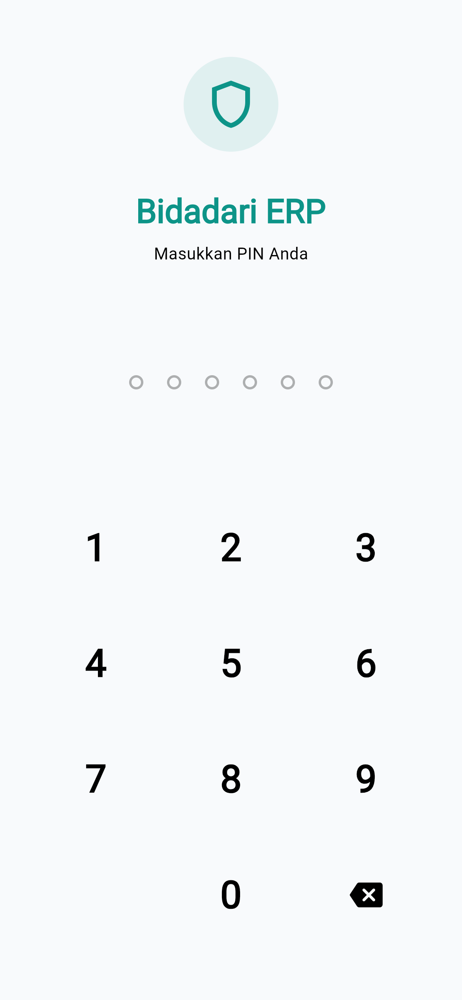

# Laporan Progres Tugas Akhir - Minggu 2
**Fase:** Pengembangan Frontend (Fase Antarmuka)

Fokus minggu ini adalah mengubah desain konseptual (*mockup*) menjadi kode pemrograman Flutter yang nyata.

## 1. Setup Proyek & Manajemen Repositori
- **Inisiasi Proyek:** Proyek Flutter terbaru berhasil di-setup.
- **Version Control:** Terhubung dengan aman ke GitHub.
- **Struktur Folder (Clean Architecture):**
  - `lib/screens/` (Halaman Antarmuka)
  - `lib/widgets/` (Komponen UI *Reusable*)
  - `lib/providers/` (State Management)
  - `lib/models/` (Struktur Data)

## 2. Integrasi Aset Visual & Tipografi
- **Logo:** Berhasil diintegrasikan ke dalam aset proyek.
  <br>
- **Tipografi:** Menggunakan **Google Fonts** yang diatur secara terpusat pada `ThemeData` di `theme_provider.dart`.

## 3. Slicing UI (Implementasi Desain ke Kode)
Desain dari Figma telah diterjemahkan ke dalam kode Flutter dengan presisi pixel dan responsif.

<table border="0" width="100%" style="text-align: center; border-collapse: collapse; border: none;">
  <tr style="page-break-inside: avoid;">
    <td width="50%" style="border: none; padding: 10px; vertical-align: top;">
      <br><br>
      <b style="font-size: 14px;">Halaman Login</b>
    </td>
    <td width="50%" style="border: none; padding: 10px; vertical-align: top;">
      <br><br>
      <b style="font-size: 14px;">Dashboard Utama</b>
    </td>
  </tr>
  <tr style="page-break-inside: avoid;">
    <td width="50%" style="border: none; padding: 10px; vertical-align: top;">
      <br><br>
      <b style="font-size: 14px;">Form Pemasukan</b>
    </td>
    <td width="50%" style="border: none; padding: 10px; vertical-align: top;">
      <br><br>
      <b style="font-size: 14px;">Laporan Utang</b>
    </td>
  </tr>
</table>

## 4. Sistem Navigasi (Routing)
Menerapkan skema **Named Routes** terpusat agar perpindahan antar halaman lebih terstruktur, serta integrasi **Bottom Navigation Bar** untuk menu utama.

**Skema Routing di `main.dart`:**
```dart
routes: {
  '/': (context) => const AuthWrapper(),
  '/login': (context) => const LoginScreen(),
  '/dashboard': (context) => const MainLayout(),
  '/income_form': (context) => const IncomeFormScreen(),
  '/expense_form': (context) => const ExpenseFormScreen(),
  '/debt_form': (context) => const DebtFormScreen(),
  '/debt_report': (context) => const DebtReportScreen(),
  '/notification': (context) => const NotificationScreen(),
}
```

---

**Kesimpulan Minggu 2:**  
Fase *Frontend* rampung 100%. Antarmuka sudah berfungsi secara visual dan siap disambungkan dengan logika *Database* Firebase di minggu ketiga.
