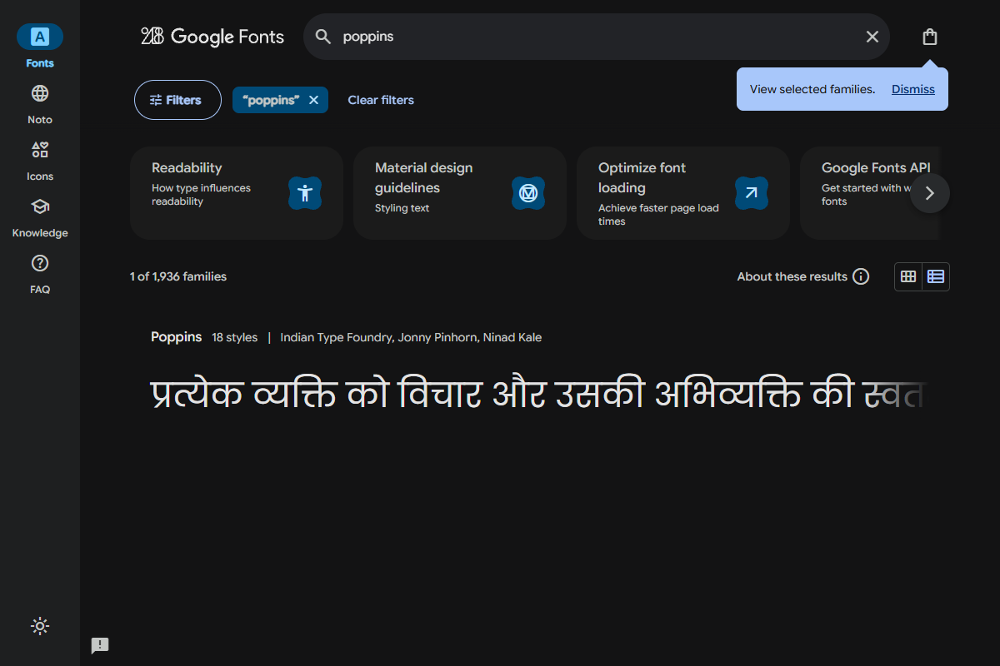
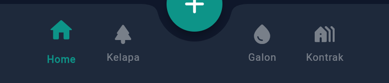

# TUGAS MINGGU 2: Pengembangan Frontend (Fase Antarmuka)

**Nama Proyek:** Aplikasi Manajemen Keuangan  
**Anggota Kelompok:**
- Bagas Sujiwo (2306018)
- Romy Zaenul Alam (2306019) 
- Firman Nur Hakim (2305107) 

**Mata Kuliah:** Pemrograman Mobile  

---

## 1. Setup Proyek & Manajemen Repositori
Proyek Flutter berhasil diinisiasi dengan arsitektur folder yang rapi dan terstruktur untuk memisahkan antarmuka (*screens*), manajemen status (*providers*), dan komponen (*widgets*). Seluruh pengerjaan telah diamankan menggunakan Git dan dapat diakses langsung pada repositori berikut:

**🔗 Link Repositori Github:** [Gaszx/TugasAkhir_AppKeuangan](https://github.com/Gaszx/TugasAkhir_AppKeuangan)


```text
Aplikasi-keuangan/
├── android/
├── aset/
│   └── screenshot/
├── lib/
│   ├── models/
│   ├── providers/
│   ├── screens/
│   ├── services/
│   ├── widgets/
│   ├── firebase_options.dart
│   └── main.dart
├── pubspec.yaml
└── README.md
```

## 2. Integrasi Aset Visual & Tipografi
- **Logo Aplikasi:** Logo Bidadari ERP dimasukkan dengan sukses ke dalam direktori proyek.
  <div align="center">
    
  </div>

- **Tipografi:** Menggunakan **Google Fonts (Poppins)** untuk menghadirkan kesan modern dan elegan. Pengaturan *font* diaplikasikan secara terpusat pada sistem tema aplikasi.
  <br>
  

## 3. Slicing UI (Implementasi Desain ke Kode)
Desain dari purwarupa Figma telah diterjemahkan menjadi kode Flutter yang nyata dan responsif. 

<table border="0" width="100%" style="text-align: center; border-collapse: collapse; border: none;">
  <tr style="page-break-inside: avoid;">
    <td width="50%" style="border: none; padding: 10px; vertical-align: top;">
      <br><br>
      <b style="font-size: 14px;">Halaman Login</b>
    </td>
    <td width="50%" style="border: none; padding: 10px; vertical-align: top;">
      <br><br>
      <b style="font-size: 14px;">Dashboard Utama</b>
    </td>
  </tr>
  <tr style="page-break-inside: avoid;">
    <td width="50%" style="border: none; padding: 10px; vertical-align: top;">
      <br><br>
      <b style="font-size: 14px;">Form Pemasukan</b>
    </td>
    <td width="50%" style="border: none; padding: 10px; vertical-align: top;">
      <br><br>
      <b style="font-size: 14px;">Laporan Utang</b>
    </td>
  </tr>
</table>

## 4. Sistem Navigasi (Routing)
Kami merancang perpindahan halaman secara terpusat menggunakan sistem rute (*Named Routes*), serta menanamkan **Bottom Navigation Bar** sebagai pusat kontrol antar-menu pelaporan, sehingga pengguna dapat berpindah bagian dengan sangat mulus.

<div align="center">
  
  <br><i style="font-size: 13px;">Gambar: Deretan tombol navigasi bawah (Home, Lap Kelapa, Lap Galon, Lap Kontrakan).</i>
</div>

---

**Kesimpulan Minggu 2:**  
Fase *Frontend* telah rampung 100%. Antarmuka aplikasi sudah berfungsi penuh secara visual dan siap untuk disambungkan dengan logika *database* Firebase pada pengerjaan minggu berikutnya.
