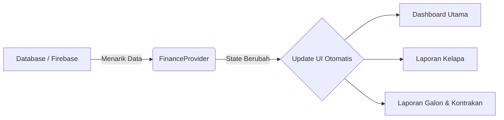
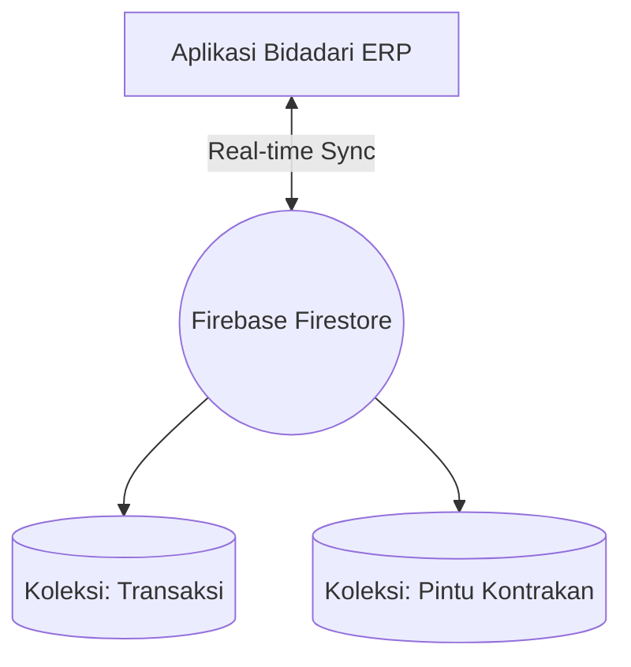

# TUGAS MINGGU 3: Logika Bisnis dan Integrasi Data (Fase Dinamis)

**Nama Proyek:** Aplikasi Manajemen Keuangan  
**Anggota Kelompok:**
- Bagas Sujiwo (2306018)
- Romy Zaenul Alam (2306019) 
- Firman Nur Hakim (2305107) 

**Mata Kuliah:** Pemrograman Mobile  

---

## 1. Manajemen State (State Management)
Alih-alih menggunakan pengiriman data manual antar halaman yang rumit, kami merancang arsitektur **Provider** (`ChangeNotifier`) agar data keuangan tersinkronisasi secara otomatis di seluruh sudut aplikasi tanpa harus me-*reload* layar.

## 2. Integrasi Backend (Database Cloud)
Aplikasi kami telah mengudara secara *online*. Infrastruktur penyimpanan data tidak lagi berupa statis, melainkan ditenagai penuh oleh **Firebase Cloud Firestore**.

## 3. Implementasi Fungsi CRUD (Create, Read, Update, Delete)
Fungsi logika bisnis telah terhubung 100%. Pengguna dapat menginput transaksi baru secara nyata (*Create*), dan hasilnya akan langsung terkalkulasi lalu dirender pada halaman laporan (*Read*).

<table border="0" width="100%" style="text-align: center; border-collapse: collapse; border: none;">
  <tr>
    <td width="50%" style="border: none; padding: 10px; vertical-align: top;">
        
      <b style="font-size: 14px;">1. Form Input (Create)</b>
    </td>
    <td width="50%" style="border: none; padding: 10px; vertical-align: top;">
        
      <b style="font-size: 14px;">2. Hasil Laporan (Read)</b>
    </td>
  </tr>
</table>

## 4. Penanganan Error Dasar (Error Handling)
Untuk memberikan pengalaman pengguna (*User Experience*) terbaik, seluruh aksi diamankan oleh validasi ketat. Aplikasi akan memberikan umpan balik (*feedback*) instan melalui **Snackbar Pop-up** tanpa harus berpindah halaman.

  
   <i style="font-size: 13px;">Gambar: Pop-up konfirmasi (sukses) saat data masuk ke Firebase.</i>
  
    

  
   <i style="font-size: 13px;">Gambar: Pop-up peringatan (error) jika input form tidak lengkap.</i>

---

**Kesimpulan Minggu 3:**  
Sistem aplikasi telah menjadi dinamis seutuhnya. Arsitektur data telah terbentuk sempurna berkat kombinasi *Provider* dan *Firebase*, menghasilkan pergerakan pencatatan uang yang akurat dan interaktif.
