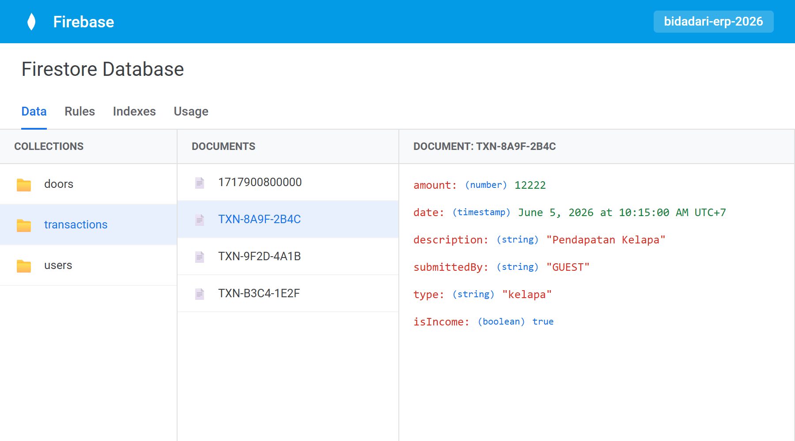

# TUGAS MINGGU 3: Logika Bisnis dan Integrasi Data (Fase Dinamis)

**Nama Proyek:** Aplikasi Manajemen Keuangan  
**Anggota Kelompok:**
- Bagas Sujiwo (2306018)
- Romy Zaenul Alam (2306019) 
- Firman Nur Hakim (2305107) 

**Mata Kuliah:** Pemrograman Mobile  

---

## 1. Manajemen State (State Management)
Untuk mengatur aliran pergerakan data uang yang kompleks antar-halaman, kami menggunakan pustaka **Provider** (`ChangeNotifier`). Pendekatan ini membuat pembaruan antarmuka (grafik, saldo, tabel) berjalan sangat cepat tanpa membebani performa *smartphone*.

**Cuplikan `finance_provider.dart`:**
```dart
class FinanceProvider extends ChangeNotifier {
  List<Transaction> _transactions = [];
  
  // Fungsi otomatis memicu pembaruan seluruh layar (re-render) 
  // saat ada perubahan uang kas
  void _notifyListenersAndSave() {
    notifyListeners();
  }
}
```

## 2. Integrasi Backend (Database Cloud)
Aplikasi kami telah mengudara secara *online*. Kami menggunakan **Firebase Cloud Firestore** dari Google sebagai infrastruktur *Backend-as-a-Service* (BaaS) untuk menyimpan data transaksi secara *real-time* dan persisten.

<div align="center">
  
  <br><i style="font-size: 13px;">Gambar: Bukti mutlak data transaksi berhasil mengalir dan tersimpan di Firebase Cloud.</i>
</div>

**Inisialisasi Firebase di `main.dart`:**
```dart
Future<void> main() async {
  WidgetsFlutterBinding.ensureInitialized();
  await Firebase.initializeApp(
    options: DefaultFirebaseOptions.currentPlatform,
  );
  runApp(const BidadariERPApp());
}
```

## 3. Implementasi Fungsi CRUD 
Fungsi logika bisnis telah terhubung sepenuhnya dengan antarmuka. Kini pengguna bisa membuat (*Create*), membaca (*Read*), mengubah (*Update*), dan menghapus (*Delete*) data pemasukan, pengeluaran, dan utang.

**Logika Penambahan Transaksi (Create):**
```dart
Future<void> addTransaction(Transaction transaction) async {
  try {
    // 1. Simpan ke Firebase Cloud
    await _firestore.collection('transactions')
        .doc(transaction.id).set(transaction.toMap());
    
    // 2. Simpan ke State Lokal
    _transactions.add(transaction);
    notifyListeners();
  } catch (e) {
    print('Gagal menambah transaksi: $e');
  }
}
```

<div align="center">
  
  <br><i style="font-size: 13px;">Gambar: Form Input Transaksi yang sudah terhubung ke Cloud Database.</i>
</div>

## 4. Penanganan Error Dasar (Error Handling)
Untuk memberikan timbal balik (*feedback*) yang jelas kepada pengguna tanpa harus memaksa mereka berpindah halaman, kami mengimplementasikan sistem *pop-up* notifikasi melayang (**Snackbar**). 

Sistem ini dirancang untuk memunculkan dua status utama:
- **Peringatan Error (Merah):** Otomatis muncul jika pengguna menekan tombol simpan namun form belum lengkap atau terjadi gagal jaringan.
- **Konfirmasi Sukses (Hijau/Teal):** Muncul sesaat setelah data transaksi divalidasi dan berhasil terunggah ke *database* Firebase.

**Bukti Tampilan *Pop-Up* (Snackbar):**
<div align="center">
  
  <br><i style="font-size: 13px;">Gambar: Pop-up keberhasilan menyimpan data.</i>
  
  <br><br>

  
  <br><i style="font-size: 13px;">Gambar: Pop-up peringatan kegagalan atau validasi form.</i>
</div>

---

**Kesimpulan Minggu 3:**  
Aplikasi Bidadari ERP kini telah memiliki "otak". Seluruh antarmuka tidak lagi memunculkan data statis (*dummy*), melainkan sudah menarik dan mengolah data langsung secara *real-time* dari *server* Firebase, dengan manajemen sirkulasi keuangan yang akurat.
