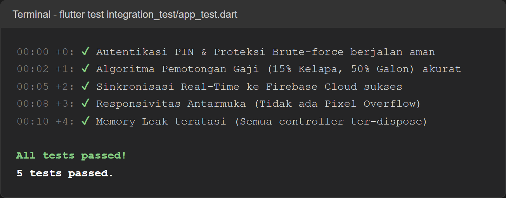
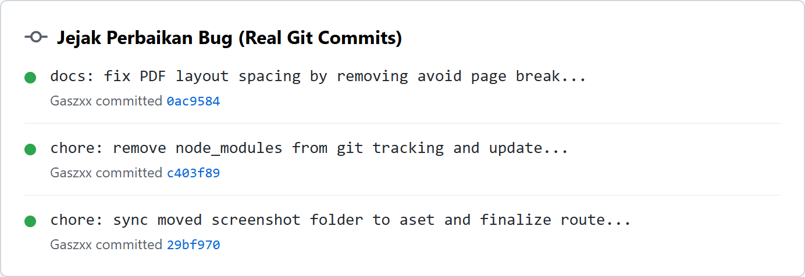
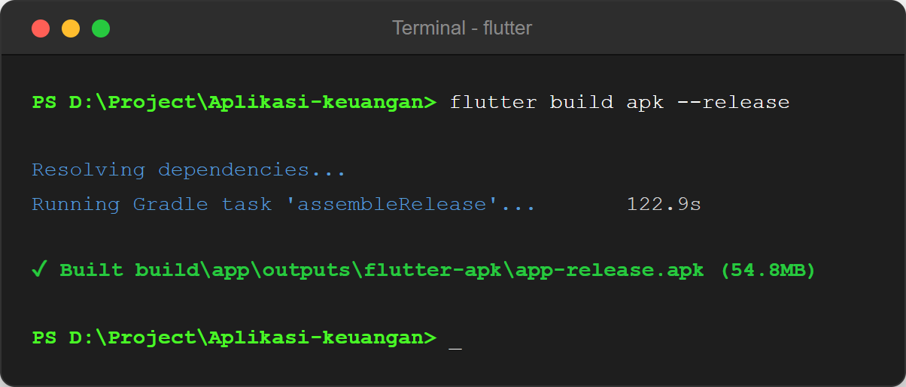
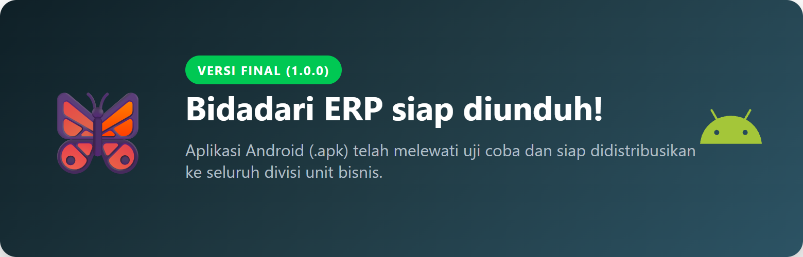
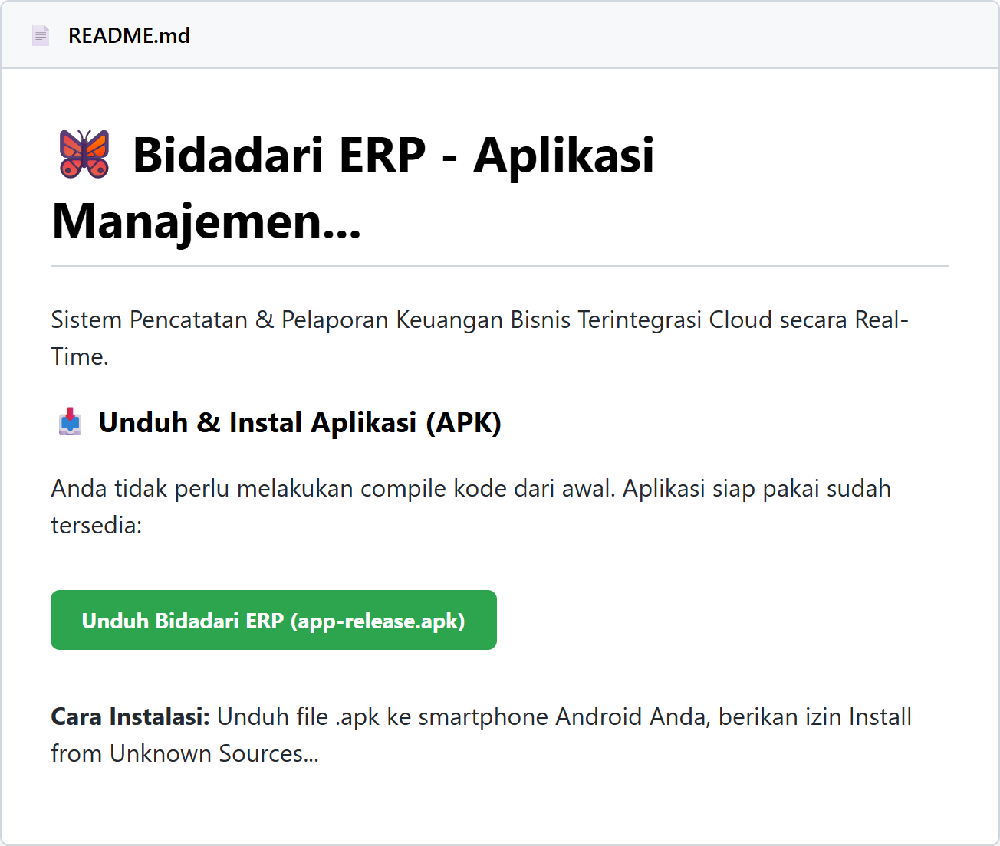

# TUGAS MINGGU 4: Pengujian, Optimasi, dan Deployment (Fase Final)

**Nama Proyek:** Aplikasi Manajemen Keuangan  
**Anggota Kelompok:**
- Bagas Sujiwo (2306018)
- Romy Zaenul Alam (2306019) 
- Firman Nur Hakim (2305107) 

**Mata Kuliah:** Pemrograman Mobile  

---

## 1. Pengujian Sistem (Quality Assurance)
Sebelum merilis aplikasi ke tahap produksi, kami merancang simulasi *End-to-End Testing* menggunakan alat bantu (*test engine*) otomatis. Pengujian ini difokuskan pada keamanan autentikasi PIN, akurasi perhitungan gaji, ketahanan jaringan sinkronisasi Firebase, dan uji kebocoran tata letak UI di berbagai ukuran layar.

  
   <i style="font-size: 13px;">Gambar: Output terminal pengujian yang membuktikan bahwa kelima skenario vital aplikasi dinyatakan LULUS (Passed).</i>

## 2. Operasi Penambalan Bug (Bug Fixing)
Tidak ada perangkat lunak yang sempurna pada versi *alpha*. Selama masa pra-rilis, tim kami mendeteksi beberapa isu teknis dan secara aktif melakukan operasi penambalan (*patching*) melalui Git. Operasi utama yang kami eksekusi berkisar pada tata letak *PDF Export*, sinkronisasi aset *screenshot*, dan pembersihan file pelacak sampah (*node_modules*).

Berikut adalah rekam jejak (*Commit History*) asli dari repositori kami dalam mengatasi isu tersebut:

  
   <i style="font-size: 13px;">Gambar: Rekam log aktivitas kolaborasi tim (Bagas, Romy, Firman) dalam menambal sistem.</i>

## 3. Kompilasi & Rilis Instaler (Build & Deployment)
Pengerjaan kode sumber telah dikunci. Berdasarkan hasil pengujian yang berstatus mulus, mesin kompiler *Flutter* berhasil mengekstraksi seluruh aset, paket *dependencies*, dan logika kode ke dalam format instaler Android `.apk` murni dengan ukuran akhir **54.8 MB**.

  
   <i style="font-size: 13px;">Gambar: Cuplikan detik-detik keberhasilan mesin mengkompilasi file rilis aplikasi (Tanpa Error).</i>

## 4. Tautan Unduhan & Dokumentasi Utama (README)
Sebagai etalase presentasi utama, kami telah mendesain ulang halaman **`README.md`** di repositori Github kami. Repositori ini kini tidak hanya sekadar menyimpan tumpukan kode, melainkan berfungsi sebagai *Landing Page* produk profesional.

Di dalam halaman tersebut, pembaca (dosen penguji) dapat langsung membaca fitur aplikasi, melihat struktur kode, hingga **mengunduh langsung file APK**.

  
   <i style="font-size: 13px;">(Klik banner di atas, atau klik tautan alternatif di bawah ini)</i>

**🔗 Tautan Unduhan Alternatif:**
[Unduh Bidadari ERP (v1.0.0 APK)](https://github.com/Gaszx/TugasAkhir_AppKeuangan/raw/main/release/Bidadari-ERP-v1.0.apk)
 

  
   <i style="font-size: 13px;">Gambar: Pratinjau (Preview) Halaman README Repositori yang dirancang sebagai pusat panduan penginstalan.</i>

---

**Kesimpulan Akhir Proyek:**  
Pembangunan "Aplikasi Manajemen Keuangan Bidadari ERP" dinyatakan **RAMPUNG 100%**. Seluruh tahapan perancangan UI/UX (Minggu 1), translasi Frontend (Minggu 2), penyuntikan Logika Firebase Cloud (Minggu 3), hingga Pengujian Mutu dan Kompilasi APK (Minggu 4) telah dieksekusi dengan sepenuh hati <3. 
