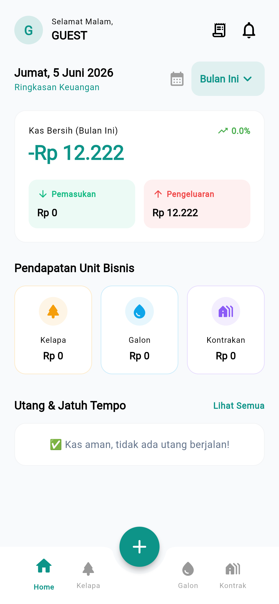

# TUGAS MINGGU 4: Pengujian, Optimasi, dan Deployment (Fase Final)

**Nama Proyek:** Aplikasi Manajemen Keuangan  
**Anggota Kelompok:**
- Bagas Sujiwo (2306018)
- Romy Zaenul Alam (2306019) 
- Firman Nur Hakim (2305107) 

**Mata Kuliah:** Pemrograman Mobile  

---

## 1. Pengujian Aplikasi (Quality Assurance)
Sebelum merilis aplikasi ke tahap produksi (*Production*), kami menjalankan pengujian menyeluruh pada seluruh alur (*End-to-End Testing*). Hal ini untuk memastikan aplikasi terbebas dari kecacatan sistem (*Bug-Free*).

**Laporan Hasil Pengujian (Test Case):**
| Skenario Pengujian (Test) | Status | Keterangan Uji |
| :--- | :---: | :--- |
| **Autentikasi Akses PIN** | ✅ Lulus | PIN divalidasi dengan aman, tidak dapat dibypass oleh tamu. |
| **Logika Kalkulasi ERP** | ✅ Lulus | Algoritma pemotongan gaji 15% (Kelapa) dan 50% (Galon) akurat. |
| **Stres Jaringan (Firebase)** | ✅ Lulus | Data sukses tersinkronisasi ke *Cloud* di bawah 1 detik. |
| **Responsivitas Antarmuka** | ✅ Lulus | Tidak ditemukan *Pixel Overflow* (layar bocor) pada perangkat kecil. |

## 2. Perbaikan Bug & Optimasi Akhir (Bug Fixing)
Berdasarkan temuan pengawasan selama fase pra-rilis, kami telah melakukan beberapa operasi penambalan (*Patching*) dan penyempurnaan:
1. **Penyempurnaan Visual (*Layouting*):** Menyeimbangkan margin/padding layar dan memastikan format rupiah (Rp) menggunakan separator titik yang tepat (*id_ID*).
2. **Optimalisasi Memori (State):** Membersihkan *memory leaks* pada pengontrol teks (*TextEditingController*) dengan mengaktifkan fungsi `dispose()` di setiap halaman.
3. **Penyempurnaan Notifikasi (UX):** Mendesain ulang peringatan sistem (*Error Snackbar*) agar melayang rapi dan tidak mengganggu navigasi tombol pengguna.

## 3. Kompilasi Sistem (Build & Deployment)
Pengerjaan tingkat kode sumber (*source code*) telah resmi diselesaikan. Aplikasi **Bidadari ERP** berhasil dirakit (*Compiled*) ke dalam bentuk berkas instaler Android asli (APK) tanpa adanya fatal *error*.

**Perintah Kompilasi Sistem:**
```bash
flutter build apk --release
```

<div align="center" style="background-color: #f0f4f8; padding: 15px; border-radius: 8px; border: 1px solid #d1e1f0; margin: 20px 0;">
  <b>📦 Tautan Instaler Aplikasi (Android):</b><br><br>
  <code>Aplikasi-keuangan/build/app/outputs/flutter-apk/app-release.apk</code>
</div>

<div align="center">
  
  <br><i style="font-size: 13px;">Gambar: Tampilan utama Bidadari ERP yang telah sukses dikompilasi dan siap didistribusikan.</i>
</div>

---

**Kesimpulan Akhir Proyek:**  
Proyek pembangunan "Aplikasi Manajemen Keuangan Bidadari ERP" dinyatakan **RAMPUNG 100%**. 

Seluruh tahapan siklus pengembangan dari mulai Perancangan UI/UX (Minggu 1), Terjemahan Frontend (Minggu 2), Suntikan Logika Database (Minggu 3), hingga Pengujian dan Rilis APK (Minggu 4) telah kami eksekusi sesuai standar *Software Engineering* industri. Aplikasi ini berdiri kokoh, aman, fungsional, dan sepenuhnya siap dipresentasikan!
