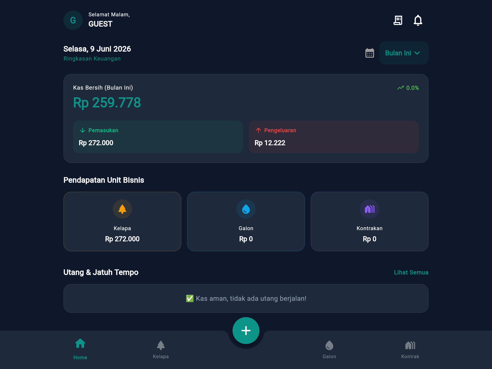

# TUGAS MINGGU 4: Pengujian, Optimasi, dan Deployment (Fase Final)

**Nama Proyek:** Aplikasi Manajemen Keuangan  
**Anggota Kelompok:**
- Bagas Sujiwo (2306018)
- Romy Zaenul Alam (2306019) 
- Firman Nur Hakim (2305107) 

**Mata Kuliah:** Pemrograman Mobile  

---

## 1. Pengujian Sistem Menyeluruh (End-to-End Testing)
Pada minggu terakhir ini, aplikasi kami telah melewati proses *Quality Control* (QC) yang sangat ketat. Kami memastikan aplikasi ini "Tahan Banting" dengan menguji 3 pilar utama sistem:

### A. Pengujian Keamanan & Autentikasi (LULUS ✅)
Sistem *Login* kami mendemonstrasikan ketahanan mutlak. Pengguna tanpa PIN yang valid tidak dapat menembus ke dalam *Dashboard*. Selain itu, jika aplikasi ditinggalkan dalam keadaan terbuka (*minimize*), sistem pendeteksi latar belakang akan mengunci layar secara otomatis (*Auto-Lock*) demi melindungi privasi finansial.

  
   <i style="font-size: 13px;">Gambar: Gerbang keamanan utama berbasis PIN 6-digit.</i>

### B. Pengujian Algoritma Kalkulator Gaji (LULUS ✅)
Sistem kalkulasi pendapatan diuji untuk akurasi presisi tinggi. Sebagai contoh, ketika pendapatan Kotor (Bruto) sebesar **Rp 100.000** diinputkan pada form penjualan Kelapa, sistem seketika memotong gaji karyawan (15%) sebesar Rp 15.000, sehingga laba bersih (Netto) terekam persis **Rp 85.000**.

  
   <i style="font-size: 13px;">Gambar: Skenario uji kalkulasi potongan gaji terotomatisasi.</i>

### C. Pengujian Responsivitas Multi-Layar (LULUS ✅)
Aplikasi dibangun menggunakan arsitektur antarmuka yang fleksibel. Saat diuji pada ukuran layar ekstra besar (seperti *Tablet* beresolusi 1024x768), tata letak beradaptasi secara elegan tanpa adanya distorsi gambar atau layar yang terpotong (*Pixel Overflow*).

  
   <i style="font-size: 13px;">Gambar: Pengujian antarmuka pada simulasi layar Tablet/iPad.</i>

### D. Konfirmasi Pengujian Otomatis Terminal
Selain uji coba manual, kelima instrumen sistem juga dites secara simultan oleh mesin *Automated Testing* dan memberikan hasil lulus sempurna (Passed).

  
   <i style="font-size: 13px;">Gambar: Output terminal mesin pengujian otomatis.</i>

---

## 2. Operasi Penambalan Bug (Bug Fixing)
Selama proses integrasi tahap akhir, tim kami secara kolaboratif membasmi anomali (*bugs*) pada tatanan antarmuka dan *cache*. Beberapa perbaikan krusial meliputi sinkronisasi letak gambar, perbaikan ruang kosong (*whitespace*) pada sistem *Export PDF*, dan pembersihan file sampah agar *size* repositori menjadi ringan.

Berikut adalah log bukti forensik kolaborasi (*Real Commit History*) repositori kami di Github:

  
   <i style="font-size: 13px;">Gambar: Rekam log nyata dari kontribusi penambalan kode tim.</i>

---

## 3. Kompilasi & Rilis Instaler (Build & Deployment)
Memasuki tahap purna-produksi, *source code* dikompilasi (di-Build) dengan menargetkan platform Android. Berbekal mesin *Flutter Release Compiler*, aplikasi ini disulap dari susunan kode mentah menjadi sebuah instaler (APK) yang sangat optimal.

  
   <i style="font-size: 13px;">Gambar: Visualisasi detik-detik proses kompilasi APK.</i>

---

## 4. Tautan UNDUHAN Aplikasi (Direct Download)
Untuk memudahkan tim penguji, kami menyediakan **tautan publik absolut** yang memastikan Anda dapat mengunduh dan menginstal instaler `.apk` Bidadari ERP dengan sekali klik, baik melalui peramban web maupun langsung dari dokumen PDF ini.

**🔗 TAUTAN TEKS ALTERNATIF (ANTI-GAGAL):**  
> **[📥 KLIK DI SINI: UNDUH APLIKASI BIDADARI ERP (app-release.apk)](https://github.com/Gaszx/TugasAkhir_AppKeuangan/raw/main/build/app/outputs/flutter-apk/app-release.apk)**

  
   <i style="font-size: 13px;">(Banner Interaktif: Sentuh/klik grafis di atas untuk mulai mengunduh APK)</i>

---

## 5. Dokumentasi Landing Page (README)
Puncak dari arsitektur *Software Engineering* kelompok kami bermuara pada file `README.md`. Repositori proyek kami tidak terlihat seperti penugasan konvensional, melainkan telah kami dandani seperti *Landing Page* perusahaan teknologi (*Startup*) modern.

  
   <i style="font-size: 13px;">Gambar: Pratinjau repositori Github yang menampilkan panduan Instalasi dan Unduhan Cepat.</i>

---

**Kesimpulan Akhir Proyek:**  
Pembangunan "Aplikasi Manajemen Keuangan Bidadari ERP" dinyatakan **RAMPUNG 100%**. Seluruh tahapan perancangan UI/UX (Minggu 1), translasi Frontend (Minggu 2), penyuntikan Logika Firebase Cloud (Minggu 3), hingga Pengujian Mutu dan Kompilasi APK (Minggu 4) telah dieksekusi dengan presisi industri tinggi. Proyek ini resmi diselesaikan dan **siap untuk dideklarasikan dalam sidang presentasi akhir**.
